# Having - 함께하는 성장의 모든 것

**Having**은 개발자, 디자이너, 기획자 등 성장을 원하는 모든 이들이 함께 모여 스터디와 프로젝트를 진행하며 시너지를 창출하는 온라인 커뮤니티 플랫폼입니다. 스터디/프로젝트 그룹 매칭부터 실시간 소통, 정보 공유, 그리고 동기부여를 위한 소셜 기능까지, 성공적인 그룹 활동에 필요한 모든 경험을 제공합니다.

<br>

<p align="center">
  
  
  
  
  
  
  
  
</p>

<br>

## ✨ 주요 기능 (Features)

### 📚 스터디 및 프로젝트 그룹 관리
- **목적별 그룹 관리**: 학습 중심의 '스터디'와 결과물 제작 중심의 '프로젝트'를 명확히 구분하여, 목적에 맞는 팀원을 효율적으로 모집하고 참여할 수 있습니다.
- **다차원 검색**: 키워드, 기술 스택(태그) 검색은 물론, 카카오맵 API를 연동한 위치 기반(주변 스터디) 검색 기능을 제공하여 오프라인 모임의 접근성을 높였습니다.
- **체계적인 멤버 관리**: 스터디장은 멤버의 참여 신청을 승인/거절하고, 기존 멤버를 초대하거나 강제 탈퇴시키는 등 그룹을 체계적으로 관리합니다.
- **참여 및 탈퇴**: 사용자는 원하는 그룹에 자유롭게 참여 신청을 하거나 자진 탈퇴할 수 있습니다.
- **스터디 캘린더**: `FullCalendar` 라이브러리를 연동하여 그룹별 일정을 생성, 수정, 삭제하고 드래그 앤 드롭으로 쉽게 관리합니다.

### 💬 실시간 소통 기능
- **그룹/개인 채팅**: 각 스터디 그룹 전용 그룹 채팅방 및 사용자 간 1:1 DM(다이렉트 메시지) 기능을 제공합니다.
- **실시간 메시징**: `WebSocket`과 `STOMP` 프로토콜을 기반으로 실시간 양방향 통신을 구현하여 끊김 없는 대화 환경을 제공합니다.
- **동시 접속자 수 표시**: Redis와 WebSocket을 연동, 스터디/게시글 상세 페이지에 현재 접속자 수를 실시간으로 표시하여 서비스에 생동감을 더하고 사용자 인터랙션을 유도합니다.

### 📝 커뮤니티 게시판
- **콘텐츠 에디터**: TOAST UI Editor를 도입하여 Markdown과 WYSIWYG 모드를 모두 지원하며, Axios를 이용한 비동기 이미지 업로드 기능을 구현하여 사용자 편의성을 극대화했습니다.
- **추천/비추천 시스템**: 유용한 게시물이나 댓글에 대한 추천/비추천 시스템을 통해 커뮤니티 내 양질의 콘텐츠가 자연스럽게 주목받도록 설계했습니다.
- **계층형 댓글**: 단순한 댓글 기능을 넘어, 특정 댓글에 대한 답글(대댓글)을 지원하여 주제에 대한 심도 깊은 논의가 가능하도록 했습니다.
- **인기 게시물**: 주간 추천 수를 기준으로 '인기 게시물'을 선정하고, Redis에 결과를 캐싱하여 메인 페이지에서 DB 접근 없이 매우 빠른 속도로 랭킹을 제공합니다.

### 🤝 소셜 및 알림 시스템
- **친구 시스템**: 사용자 간 친구 신청, 수락/거절, 친구 목록 관리 및 삭제 기능을 구현하여 커뮤니티 내 네트워킹을 강화합니다.
- **활동 피드**: 친구의 새로운 스터디/게시글 작성 소식을 받아보는 뉴스피드 기능을 통해 사용자의 지속적인 서비스 참여를 유도합니다.
- **스마트 알림**: 스터디/채팅방 초대, 참여 신청 결과, 친구 요청, 새 댓글, 좋아요 등 10가지 이상의 다양한 활동을 `SSE(Server-Sent Events)`를 통해 실시간 푸시 알림으로 제공합니다.

### 👤 사용자 및 관리자 기능
- **소셜 로그인**: `Spring Security`와 `OAuth2`를 연동하여 Google 소셜 로그인을 구현했습니다.
- **JWT 기반 인증**: Stateless 아키텍처를 위해 Access Token과 Refresh Token(Redis 저장)을 사용하는 API 인증 방식을 채택하여 보안성과 확장성을 모두 확보했습니다.
- **동기부여 시스템**: 사용자 활동(글 작성, 좋아요 등)에 따라 포인트와 레벨이 상승하고, 특정 조건을 만족하면 뱃지를 획득하는 시스템으로 서비스에 대한 사용자의 몰입도와 성취감을 높입니다.
- **신고 및 블라인드**: 부적절한 콘텐츠(게시글, 댓글, 스터디)를 신고하고, 관리자가 이를 검토하여 '숨김(블라인드)' 처리하는 기능을 구현하여 커뮤니티의 건전성을 유지합니다.
- **관리자 대시보드**: Recharts 라이브러리를 활용, 서비스의 주요 지표(일별 가입자, 콘텐츠 생성 수 등)를 시각화하고 신고 내역을 효율적으로 관리할 수 있는 관리자 전용 페이지를 제공합니다.

<br>

## 🎥 주요 기능 시연

### 1. 소셜 로그인
<p align="center">
  
</p>
<br>

### 2. 스터디 생성 및 상세화면
<p align="center">
  
</p>
<br>

### 3. 스터디 신청하기
<p align="center">
  
</p>
<br>

### 4. 친구 신청 및 DM
<p align="center">
  
</p>
<br>

### 5. 스터디 멤버 초대
<p align="center">
  
</p>
<br>

### 6. 스터디 일정 추가 및 수정
<p align="center">
  
</p>
<br>

### 7. 채팅방 초대 및 채팅
<p align="center">
  
</p>
<br>

### 8. 채팅방 멤버 내보내기
<p align="center">
  
</p>
<br>

### 9. 카카오맵으로 주변 스터디 찾기
<p align="center">
  
</p>
<br>

### 10. 게시물 작성 및 댓글 작성
<p align="center">
  
</p>
<br>

### 11. 신고 기능 및 관리자 신고 처리
<p align="center">
  
</p>
<br>

## 🌊 동작 시나리오 (Sequence Flow)

### 신규 사용자의 소셜 로그인

<br>

### 스터디 그룹 관리 (생성)
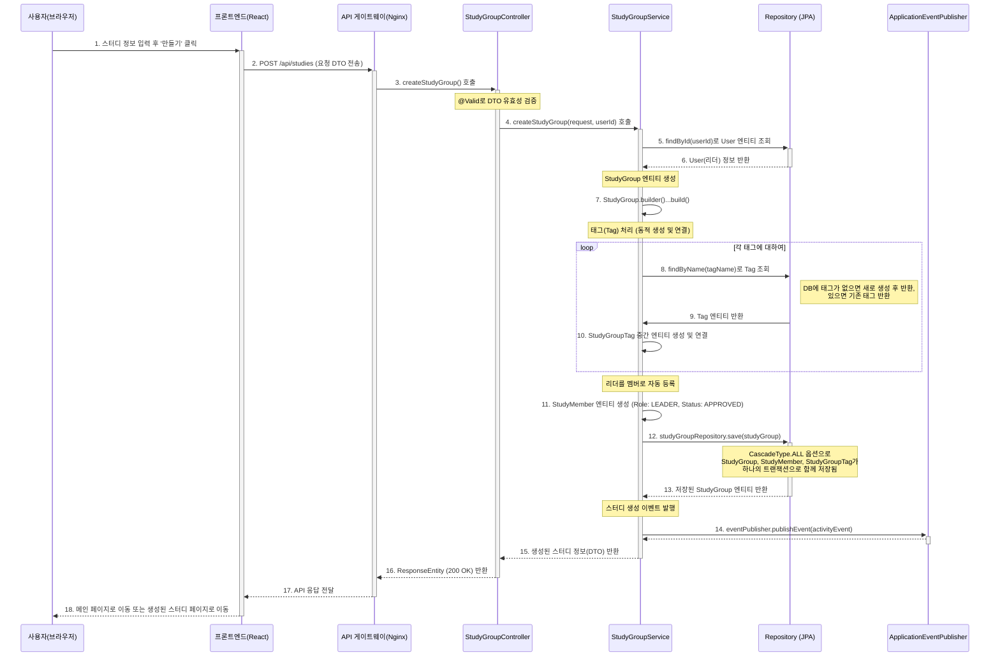
<br>

### 스터디 그룹 관리 (상세/목록 조회)
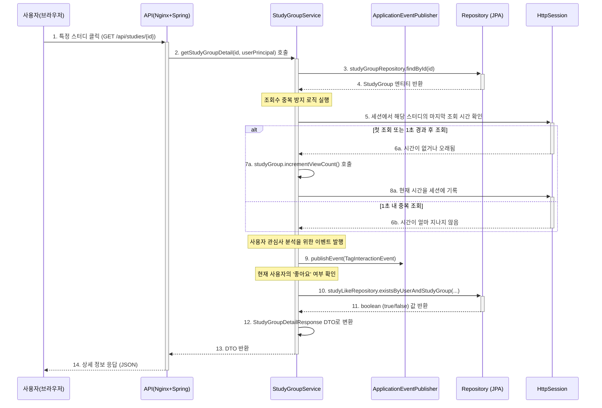
<br>

### 스터디 그룹 관리 (멤버 및 일정)
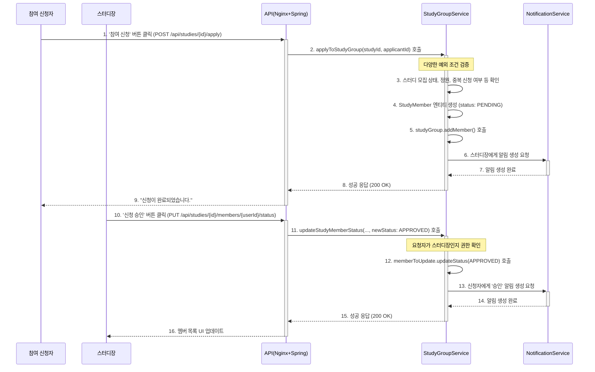
<br>

### 위치 기반 주변 스터디 조회 (지도 연동)
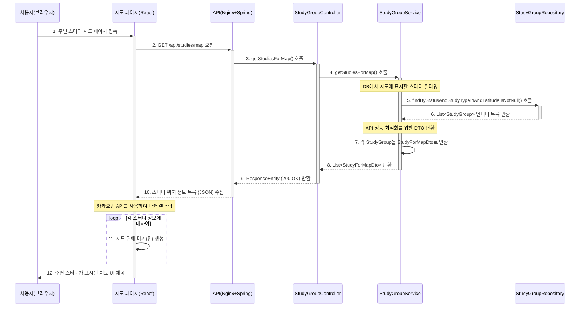
<br>

### 커뮤니티 게시판
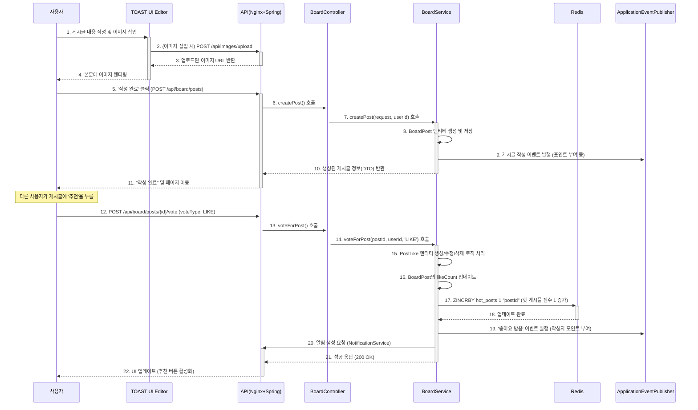
<br>

### 커뮤니티 게시판 (계층형 댓글)
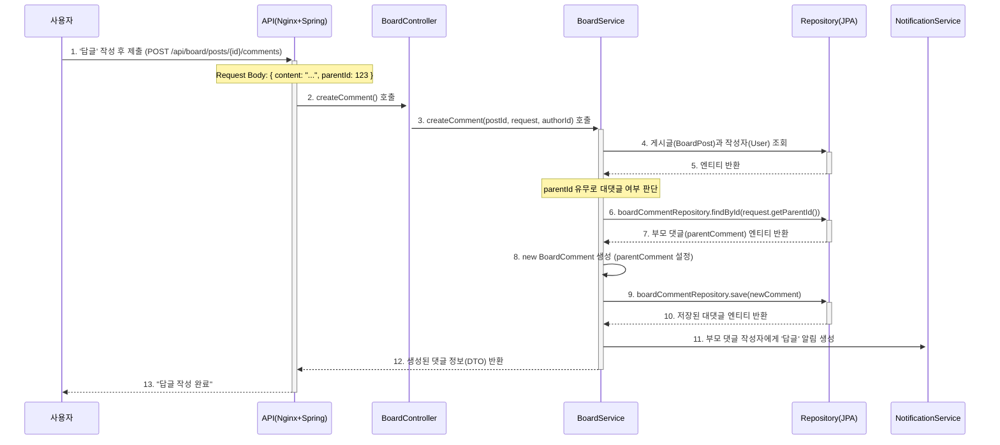
<br>

### 커뮤니티 게시판 (핫 게시물 랭킹 시스템)
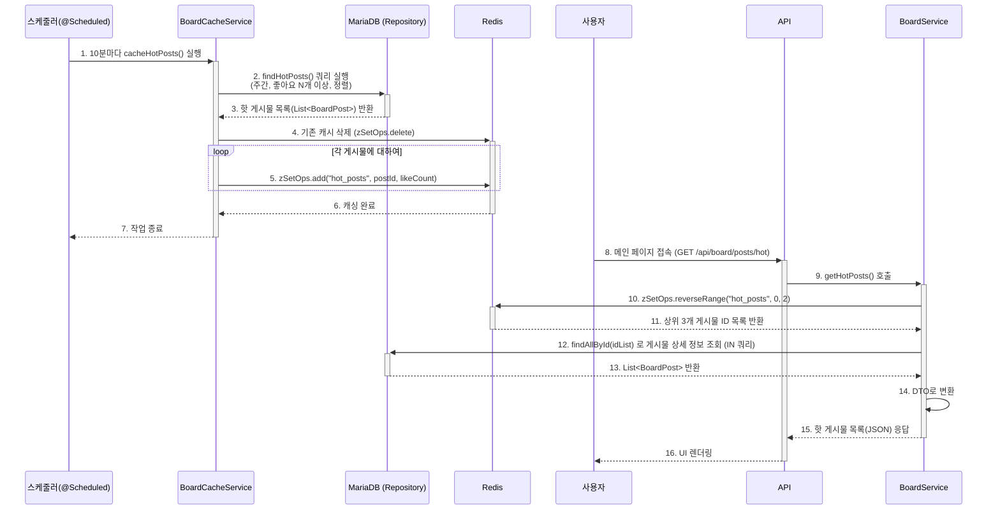
<br>

### 사용자 활동과 비동기 보상 처리
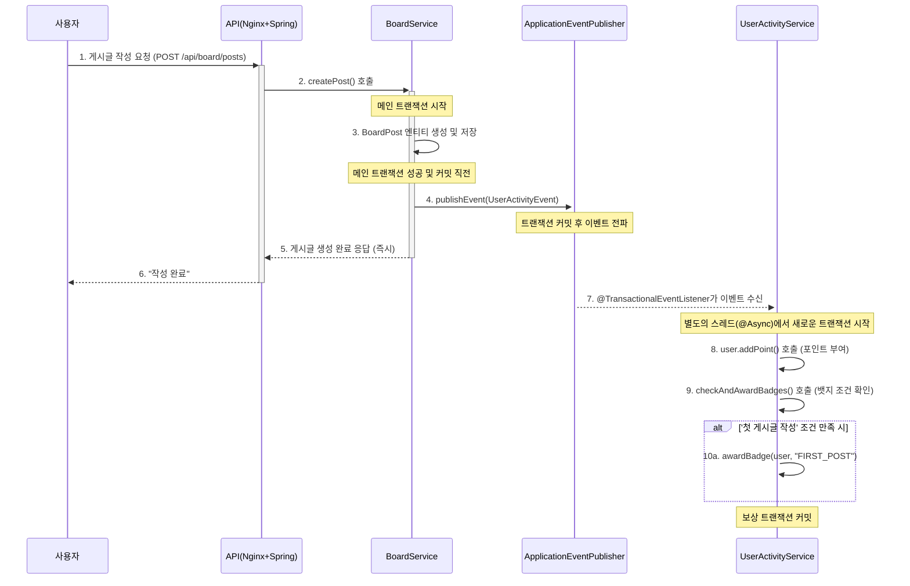
<br>

### 사용자 신고 및 관리자 처리
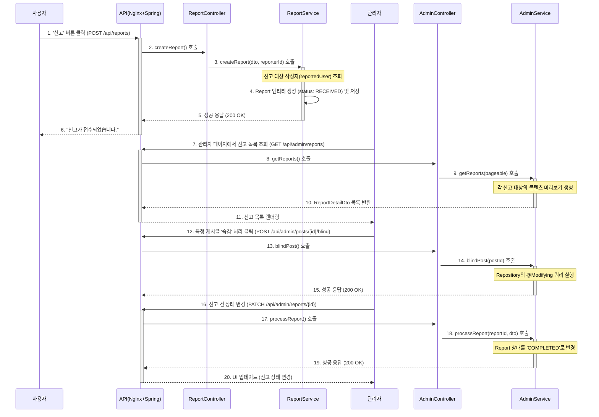
<br>

### 실시간 채팅 및 DM 시스템 (WebSocket & STOMP)
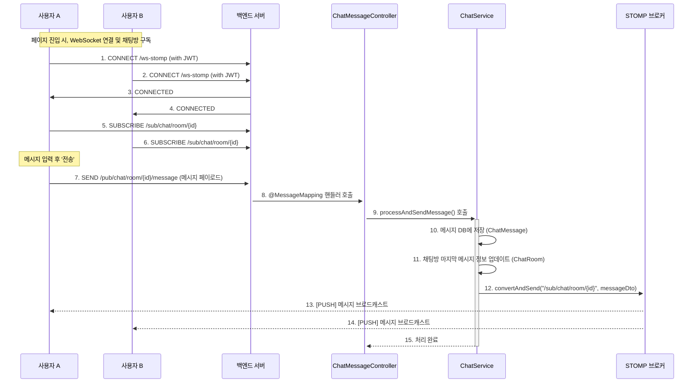
<br>

### 실시간 알림 시스템 (Server-Sent Events)
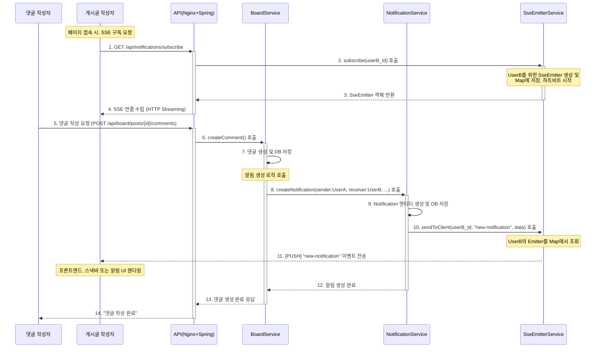

<br>

## 🚀 기술적 도전 및 최적화 경험

본 프로젝트는 단순히 기능을 구현하는 것을 넘어, 실제 서비스 환경에서 발생할 수 있는 문제들을 예측하고 해결하는 데 중점을 두었습니다.

### 1. Redis를 활용한 성능 최적화
RDBMS의 부하를 줄이고 사용자 응답 속도를 향상시키기 위해, 데이터의 특성에 따라 Redis를 다각도로 활용했습니다.
- **Refresh Token 저장소**: 빈번한 인증 I/O 작업을 DB에서 분리하고, Redis의 TTL을 이용해 만료된 토큰을 자동 관리함으로써 인증 성능과 운영 효율성을 높였습니다.
- **읽기 성능 최적화 (Look-Aside Caching)**: 반복 조회되는 스터디/게시글 상세 정보에 Spring Cache(`@Cacheable`, `@CacheEvict`)를 적용하여 DB 부하를 줄이고 응답 속도를 개선했습니다. 데이터 변경 시 캐시를 동기화하는 전략을 구현했습니다.
- **랭킹보드 캐싱**: 집계 연산이 많은 '핫 게시물' 목록을 `@Scheduled`를 통해 주기적으로 미리 계산하고, Redis의 **Sorted Set(ZSET)** 에 저장하여 DB 접근 없이 매우 빠른 랭킹 조회가 가능하도록 설계했습니다.

### 2. 이벤트 기반 비동기 아키텍처
사용자의 활동(글 작성, 스터디 생성 등)에 따른 부가적인 작업(포인트 부여, 뱃지 수여, 활동 피드 생성)을 비동기적으로 처리하기 위해 Spring의 **`ApplicationEventPublisher`** 를 도입했습니다.
- `@TransactionalEventListener`와 `@Async`를 조합하여, 메인 트랜잭션이 성공적으로 커밋된 후에만 별도의 스레드에서 부가 작업을 실행하도록 보장했습니다.
- 이를 통해 **메인 요청의 응답 시간을 단축** 하고, 부가 기능의 실패가 원래의 비즈니스 로직에 영향을 주지 않는 **안정적이고 확장 가능한 시스템**을 구축했습니다.

### 3. 실시간 통신 및 동시성 관리
`WebSocket(STOMP)`과 `SSE`를 목적에 맞게 사용하여 실시간 기능을 구현했습니다.
- **채팅/DM**: 양방향 통신이 필수적인 채팅 기능에는 STOMP 프로토콜을 사용했습니다.
- **알림**: 서버에서 클라이언트로의 단방향 데이터 전송만 필요한 실시간 알림에는 더 가벼운 SSE를 채택했습니다.
- **동시 접속자 수**: `Redis Set`을 이용하여 각 페이지(채널)별 접속자를 실시간으로 집계하고, 사용자의 입장/퇴장/연결종료 이벤트를 처리하여 현재 접속자 수를 모든 클라이언트에게 브로드캐스팅하는 기능을 구현했습니다.

<br>

## 🛠️ 기술 스택 (Tech Stack)

### Backend
- **Framework**: `Spring Boot 3.3.0`
- **Language**: `Java 17`
- **Database**: `MariaDB`, `Redis`
- **Data-Access**: `Spring Data JPA` (Hibernate)
- **Security**: `Spring Security`, `OAuth2`, `JWT (jjwt)`
- **Real-time**: `Spring WebSocket` (with `STOMP`), `Server-Sent Events (SSE)`
- **DevOps**: `Docker`, `Docker Compose`, `Github Actions`
- **Cloud**: `Oracle Cloud Infrastructure (OCI) - Compute, VCN`
- **Caching & Messaging**: `Redis`
- **Asynchronous**: `Spring ApplicationEvent`, `@Async`
- **Build Tool**: `Gradle`

### Frontend
- **Framework**: `React` (with `TypeScript`)
- **UI Library**: `Material-UI (MUI) v5`
- **Routing**: `React Router v6`
- **State Management**: `React Context API`
- **API Client**: `Axios` (with Interceptors)
- **Real-time**: `@stomp/stompjs`, `SockJS`, `EventSource`
- **Charts & Editor**: `Recharts`, `TOAST UI Editor`

### Infrastructure
- **Containerization**: `Docker`, `Docker Compose`
- **CI/CD**: `GitHub Actions`
- **Deployment**: `Oracle Cloud Infrastructure (OCI)`

<br>

## 🏛️ 아키텍처 & ERD

```mermaid
erDiagram
    %% --- Central Entity: User ---
    USER {
        Long id PK
        String email
        String name
        String profile
        Role role
        AuthProvider provider
        int point
        int level
    }

    %% --- User and Authentication ---
    REFRESH_TOKEN {
        Long id PK
        Long userId FK
        String token
    }
    USER ||--o{ REFRESH_TOKEN : "has one"

    %% --- User and Badge (M:N) ---
    BADGE {
        Long id PK
        String name
        String description
        String imageUrl
    }
    USER_BADGE {
        Long id PK
        Long user_id FK
        Long badge_id FK
    }
    USER ||--|{ USER_BADGE : "has many"
    BADGE ||--|{ USER_BADGE : "has many"

    %% --- User and Friendship (Self-referencing M:N) ---
    FRIENDSHIP {
        Long id PK
        Long user_id FK "requests"
        Long friend_id FK "receives"
        FriendshipStatus status
    }
    USER ||--o{ FRIENDSHIP : "sends"
    USER ||--o{ FRIENDSHIP : "receives"

    %% --- User and Feed/Notification ---
    FEED {
        Long id PK
        Long owner_id FK "is owned by"
        Long actor_id FK "is acted by"
        ActivityType activityType
        Long referenceId
    }
    NOTIFICATION {
        Long id PK
        Long receiver_id FK "receives"
        Long sender_id FK "is sent by"
        NotificationType type
        Long referenceId
    }
    USER ||--o{ FEED : "owns"
    USER ||--o{ FEED : "acts in"
    USER ||--o{ NOTIFICATION : "receives"
    USER ||--o{ NOTIFICATION : "sends"

    %% --- User and Report ---
    REPORT {
        Long id PK
        Long reporter_id FK "reports"
        Long reported_user_id FK "is reported"
        ReportType reportType
        Long targetId
    }
    USER ||--o{ REPORT : "reports"
    USER ||--o{ REPORT : "is reported in"

    %% --- StudyGroup and related entities ---
    STUDY_GROUP {
        Long id PK
        Long leader_id FK
        String title
        StudyCategory category
        int maxMembers
        StudyStatus status
        StudyType studyType
        Double latitude
        Double longitude
    }
    USER ||--o{ STUDY_GROUP : "leads"

    %% --- StudyGroup and User (M:N via StudyMember) ---
    STUDY_MEMBER {
        Long id PK
        Long user_id FK
        Long study_group_id FK
        StudyMemberRole role
        StudyMemberStatus status
    }
    USER ||--|{ STUDY_MEMBER : "participates in"
    STUDY_GROUP ||--|{ STUDY_MEMBER : "has"

    %% --- StudyGroup and Tag (M:N via StudyGroupTag) ---
    TAG {
        Long id PK
        String name
    }
    STUDY_GROUP_TAG {
        Long id PK
        Long study_group_id FK
        Long tag_id FK
    }
    STUDY_GROUP ||--|{ STUDY_GROUP_TAG : "has"
    TAG ||--|{ STUDY_GROUP_TAG : "is tagged on"
    
    %% --- User and Tag Preference (M:N) ---
    USER_TAG_PREFERENCE {
        Long id PK
        Long user_id FK
        Long tag_id FK
        int score
    }
    USER ||--|{ USER_TAG_PREFERENCE : "has preference for"
    TAG ||--|{ USER_TAG_PREFERENCE : "is preferred by"

    %% --- StudyGroup and other entities ---
    STUDY_LIKE {
        Long id PK
        Long user_id FK
        Long study_group_id FK
    }
    STUDY_SCHEDULE {
        Long id PK
        Long study_group_id FK
        String title
        LocalDateTime startTime
        LocalDateTime endTime
    }
    USER ||--o{ STUDY_LIKE : "likes"
    STUDY_GROUP ||--o{ STUDY_LIKE : "is liked by"
    STUDY_GROUP ||--o{ STUDY_SCHEDULE : "has"
    
    %% --- Board and related entities ---
    BOARD_POST {
        Long id PK
        Long author_id FK
        BoardCategory category
        String title
        int viewCount
        int likeCount
    }
    USER ||--o{ BOARD_POST : "authors"
    
    BOARD_COMMENT {
        Long id PK
        Long board_post_id FK
        Long author_id FK
        Long parent_comment_id FK "replies to"
        int likeCount
    }
    BOARD_POST ||--o{ BOARD_COMMENT : "has"
    USER ||--o{ BOARD_COMMENT : "authors"
    BOARD_COMMENT ||--o{ BOARD_COMMENT : "has reply"

    POST_LIKE {
        Long id PK
        Long user_id FK
        Long board_post_id FK
        VoteType voteType
    }
    USER ||--o{ POST_LIKE : "votes on"
    BOARD_POST ||--o{ POST_LIKE : "is voted on by"

    COMMENT_LIKE {
        Long id PK
        Long user_id FK
        Long board_comment_id FK
        VoteType voteType
    }
    USER ||--o{ COMMENT_LIKE : "votes on"
    BOARD_COMMENT ||--o{ COMMENT_LIKE : "is voted on by"
    
    %% --- Chat and DM entities ---
    CHAT_ROOM {
        Long id PK
        Long study_group_id FK
        String name
    }
    STUDY_GROUP ||--o{ CHAT_ROOM : "has"

    CHAT_ROOM_MEMBER {
        Long id PK
        Long chat_room_id FK
        Long user_id FK
        ChatRoomMemberStatus status
    }
    CHAT_ROOM ||--|{ CHAT_ROOM_MEMBER : "has"
    USER ||--|{ CHAT_ROOM_MEMBER : "is in"
    
    CHAT_MESSAGE {
        Long id PK
        Long chat_room_id FK
        Long sender_id FK
        MessageType messageType
    }
    CHAT_ROOM ||--o{ CHAT_MESSAGE : "has"
    USER ||--o{ CHAT_MESSAGE : "sends"
    
    DM_ROOM {
        Long id PK
        Long user1_id FK
        Long user2_id FK
    }
    USER ||--o{ DM_ROOM : "participates in (as user1)"
    USER ||--o{ DM_ROOM : "participates in (as user2)"

    DM_MESSAGE {
        Long id PK
        Long dm_room_id FK
        Long sender_id FK
    }
    DM_ROOM ||--o{ DM_MESSAGE : "has"
    USER ||--o{ DM_MESSAGE : "sends"
```

<br>

## 🚀 시작하기 (Getting Started)

"Having" 애플리케이션은 **Docker**를 사용하여 어떤 개발 환경에서든 명령어 하나로 쉽게 전체 서비스를 실행할 수 있도록 구성되었습니다. 로컬 컴퓨터에 Java, Node.js, MariaDB, Redis를 직접 설치할 필요가 없습니다.

### Prerequisites (필수 요구사항)

- [Docker Desktop](https://www.docker.com/products/docker-desktop/) (최신 버전 설치 권장)
- [Git](https://git-scm.com/)

### Installation & Run

#### 1단계: 프로젝트 소스 코드 복제 (Clone)

먼저, 터미널을 열고 원하는 디렉토리에서 아래 명령어를 실행하여 GitHub 레포지토리를 복제합니다.

```bash
git clone https://github.com/[YOUR_GITHUB_ID]/having.git](https://github.com/suho149/study_group_having.git
cd study_group_having
```

<br>

#### 2단계: 환경 변수 설정 (`.env` 파일 생성)

프로젝트를 실행하기 위해서는 데이터베이스 비밀번호, 구글 OAuth2 클라이언트 ID/Secret, JWT 시크릿 키 등 민감한 정보들이 필요합니다. 이러한 정보들은 보안을 위해 `.env` 파일에서 관리합니다.

1. 프로젝트의 루트 디렉토리(최상위 폴더)에 `.env` 라는 이름으로 새 파일을 생성합니다.
2. 아래 **코드 블록 전체**를 복사하여 새로 만든 `.env` 파일에 붙여넣습니다.
3. `#`으로 설명된 부분을 참고하여, `your_...` 로 표시된 곳을 **자신의 실제 값으로 모두 채워주세요.**

```dotenv
# .env

# --- Docker Compose에서 사용할 데이터베이스 비밀번호 ---
# MariaDB 컨테이너의 root 계정 비밀번호로 사용됩니다.
COMPOSE_DB_PASSWORD=your_strong_db_password

# --- JWT(JSON Web Token) 시크릿 키 ---
# 64바이트 이상의 매우 긴 무작위 문자열을 권장합니다.
COMPOSE_JWT_SECRET=your_super_long_and_random_jwt_secret_key

# --- Google OAuth2 클라이언트 정보 ---
# (아래 가이드 참고하여 발급)
COMPOSE_GOOGLE_CLIENT_ID=your_google_client_id.apps.googleusercontent.com
COMPOSE_GOOGLE_CLIENT_SECRET=your_google_client_secret_code

# --- 프론트엔드에서 사용할 카카오맵 API 키 ---
# (아래 가이드 참고하여 발급)
COMPOSE_REACT_APP_KAKAO_MAP_API_KEY=your_kakao_maps_javascript_api_key

# --- 이메일 발송을 위한 Gmail 계정 정보 (선택 사항) ---
# 2단계 인증을 사용하는 경우 '앱 비밀번호'를 발급받아 사용해야 합니다.
COMPOSE_GMAIL_USERNAME=your_gmail_address@gmail.com
COMPOSE_GMAIL_APP_PASSWORD=your_gmail_app_password
```

<br>

#### 3단계: 애플리케이션 실행

모든 설정이 완료되었습니다. 터미널에서 아래 명령어 하나만 실행하면, Docker가 모든 서비스(백엔드, 프론트엔드, DB, Redis)를 자동으로 빌드하고 실행합니다.

```bash
docker-compose up --build
```
> **참고:** 최초 실행 시에는 `--build` 옵션으로 이미지를 생성해야 하며, 몇 분 정도 소요될 수 있습니다. 이후 다시 실행할 때는 `docker-compose up`만 입력하면 기존 이미지를 재사용하여 더 빠르게 시작할 수 있습니다.

여러 서비스의 로그가 터미널에 출력되다가, 에러 없이 안정화되면 모든 준비가 완료된 것입니다.

<br>

#### 4단계: 서비스 접속

웹 브라우저를 열고 아래 주소로 접속하여 "Having" 서비스를 확인해보세요.

- **`http://localhost:3000`**

<br>

### 애플리케이션 종료

프로젝트 실행을 종료하고 싶을 때는, `docker-compose up` 명령어를 실행했던 터미널에서 `Ctrl + C`를 누릅니다. 모든 컨테이너가 함께 안전하게 종료됩니다. 만약 백그라운드에서 실행했다면(`-d` 옵션), `docker-compose down` 명령어로 종료할 수 있습니다.

---

### ※ 참고: API 키 발급 가이드

#### Google OAuth 2.0 클라이언트 ID 및 시크릿 발급 방법

1. [Google Cloud Console](https://console.cloud.google.com/)에 접속하여 새 프로젝트를 생성합니다.
2. `API 및 서비스` > `사용자 인증 정보` 메뉴로 이동합니다.
3. `+ 사용자 인증 정보 만들기` > `OAuth 클라이언트 ID`를 선택합니다.
4. 애플리케이션 유형을 `웹 애플리케이션`으로 선택합니다.
5. `승인된 리디렉션 URI` 섹션에서 `+ URI 추가` 버튼을 누르고 아래 주소를 입력합니다.
    - `http://localhost:8080/login/oauth2/code/google`
6. `만들기` 버튼을 누르면 **클라이언트 ID**와 **클라이언트 보안 비밀**이 발급됩니다. 이 값들을 `.env` 파일에 각각 입력합니다.

<br>

#### Kakao Maps API JavaScript 키 발급 방법

1. [Kakao Developers](https://developers.kakao.com/)에 로그인하고 `내 애플리케이션`으로 이동합니다.
2. `+ 애플리케이션 추가하기`를 통해 새 앱을 생성합니다.
3. 생성된 앱을 선택하고, `앱 설정` > `플랫폼` 메뉴로 이동합니다.
4. `Web 플랫폼 등록` 버튼을 누르고, `사이트 도메인`에 `http://localhost:3000`을 등록합니다.
5. `앱 설정` > `요약 정보` 메뉴로 이동하여, **JavaScript 키**를 복사합니다.
6. 복사한 키를 `.env` 파일의 `COMPOSE_REACT_APP_KAKAO_MAP_API_KEY` 값으로 입력합니다.

---
